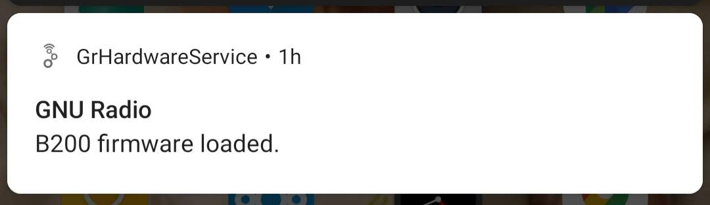

# UHD Firmware Loader for GNU Radio on Android

This is a service-only Android application that initializes Ettus Research B2XX SDRs (i.e. the most recent USB-based devices). The application does not provide any other functionality but is supposed to be used with other GNU Radio Android applications like the [Android WLAN Receiver](https://github.com/bastibl/android-wlan/).

The app is run automatically when a B2XX is connected to the phone. It loads the firmware, which causes the device to reattach to USB in a state that allows it to be used in SDR applications.

Successful loading of the firmware is indicated by a notification. When the notification shows up, the actual SDR application can be started.

## Installation

Building the app requires the [GNU Radio Android toolchain](https://github.com/bastibl/gnuradio-android/). Please see this repository for further instructions on how to build the toolchain and apps that use it.

In addition to that, this application requires the firmware images and FPGA images in the `firmware` directory to be copied to Android's *external storage* directory, which is usually mounted at `/sdcard/`.

